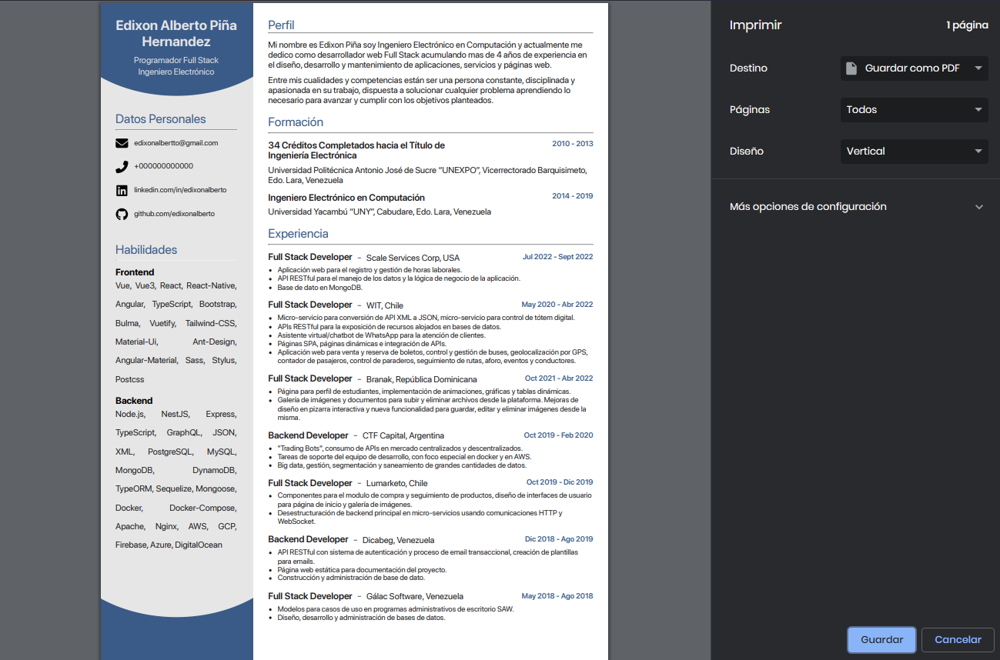

# Template CV

Template CV created with HTML and Sass



### Start development

```sh
yarn
yarn dev
```

### Get PDF from template

- Execute `yarn dev` or `yarn start` and then open the browser to display the page on "localhost".
- Then press right click "print" or `CTRL + p` (on Windows) to print the web page using the web browser.

### Commands List

```sh
# To run project in development mode
yarn dev

# To build project in production mode
yarn build

# To build and run the project locally in production mode
yarn start

# Format code with prettier
yarn lint
```
